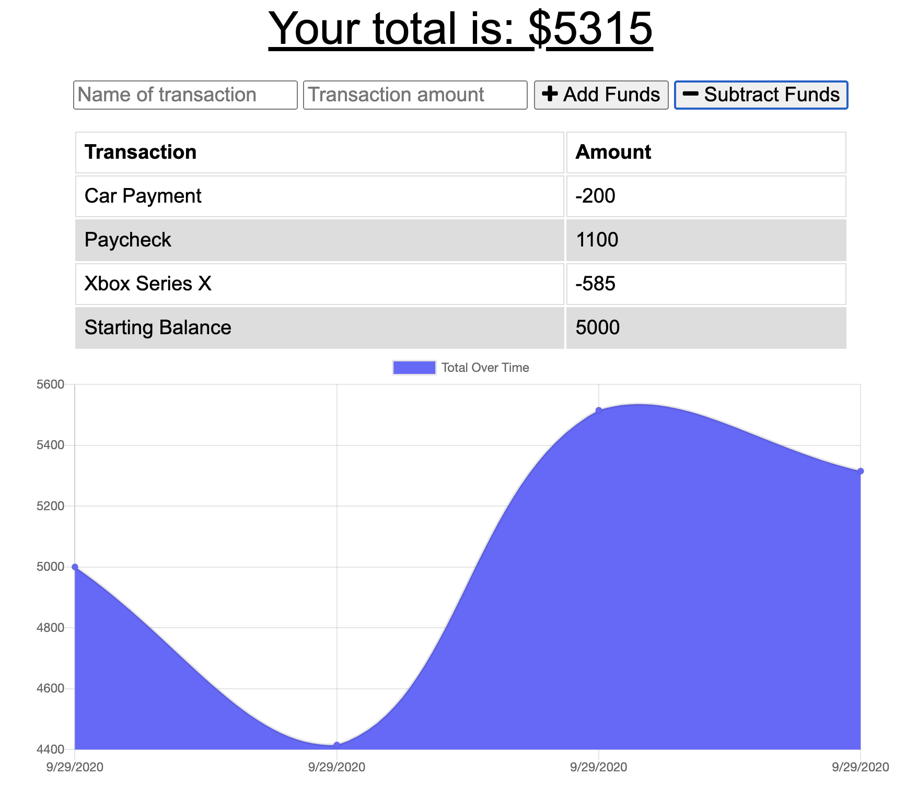

# Budget Tracker (PWA)

## TABLE OF CONTENTS
* [Description](#description)
* [Installation](#installation)
* [Usage](#usage)
* [Examples](#examples)
* [Contributing](#contributing)
* [Questions](#questions)

## Description
This budgeting app allows users to track incoming and outgoing transactions, without the need for a constant internet connection. If the application does not have a connection at the time a transaction is entered, the transaction data is stored in the indexedDB until the connection is restored. Once the connection resumes, all stored data is transfered to the database. This application can also be downloaded for easy access and usage. 

## Installation
* Run `npm install` to install the required dependencies.
* Look over the `server.js` file and edit the connection parameters where needed.
* To start the app, run `npm start` and navigate to the link that is logged in the console (unless you have edited this, it should direct you to `http://localhost:3000`)

## Usage
To add a new transaction, simply enter a name and value, then either "add funds" or "subtract funds". The item will be added to the list and the funds will be added/subtracted from your total balance. 

The app behaves the same way when offline; you should not notice any change in behavior in the user-side functionality. 

## Examples:
[Deployed Application](https://aqueous-reaches-52384.herokuapp.com/) (Heroku w/ MongoDB Atlas)

Screenshot:

## Contributing
If you would like to contribute, please open a pull request and include a detailed description with screenshots of the proposed changes.

## Questions?
Please direct all questions to cseibert2667@gmail.com, and be sure to check out my other projects at [cseibert2667](https://www.github.com/cseibert2667).
